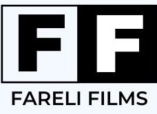

# FareliFilms - Pagina Web Multicines

**Proyecto de Prácticas - Programación Web**  
**Autor**:  
- Rafael Luque Framit

## Descripción

Este proyecto de programación web se caracteriza por ser una pagina web para unos ficticios multicines.
Para este trabajo sobre el desarrollo de una página web usé HTML y CSS para la primera parte y en esta ocasión para el desarrollo de la práctica 2 he utilizado MySQL, PHP y
JavaScript. El objetivo principal de la página web es proporcionar información sobre las películas en cartelera, los horarios de las funciones entre otras cosas.

Para más información mirar el pdf como_se_hizo.pdf
